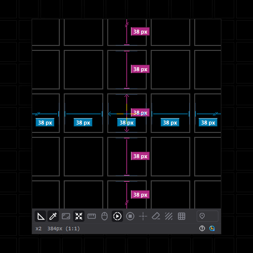

# MagicLoupe v1.0.0

[English](README.md)

https://magicloupe.vercel.app/

Windows 화면의 모든 것을 정밀하게 확인하고 측정해 주는 생산성 도구입니다.
루페 창 하나로 화면을 실시간으로 확대하고, 요소의 간격과 크기를 자동으로 측정하고,
픽셀의 정확한 색을 추출할 수 있습니다.

## 다운로드

[릴리즈 페이지](https://github.com/legendsteel11/MagicLoupe-App/releases/latest)에서 최신 버전을 다운로드할 수 있습니다.

- **`MagicLoupe.exe`**: 무설치 단일 실행 파일입니다. 원하는 곳에 두고 바로 실행할 수 있습니다.

Windows 11 이상에서 실행되며 관리자 권한이 필요하지 않습니다. 설정은 `%AppData%\MagicLoupe`에 저장됩니다.

## 스크린샷

## 주요 기능

- **실시간 확대**: 화면을 실시간으로 최대 24배까지 보간 없이 확대합니다.
- **실시간 자동 간격 측정**: 렌즈 안 요소 사이의 간격을 자동으로 찾아 픽셀 단위로 표시합니다.
- **실시간 자동 크기 측정**: 십자선이 놓인 요소의 가로, 세로 크기를 측정합니다.
- **컬러 피커**: 렌즈를 클릭해 색을 추출하고 RGB, #코드, 코드값 중 원하는 형식으로 클립보드에 복사합니다. 필터와 관계없이 원본 색을 추출합니다.
- **측정/제외 영역 지정 도구**: Shift 드래그로 측정 범위를, Alt 드래그로 측정에서 제외할 영역을 지정합니다.
- **사용자 지정 마스크**: 원하는 형태로 마스크를 그리고 마스크 간의 간격, 크기, 둘러싼 공간을 측정합니다.
- **오버레이 필터**: 그린, 레드, 모노, 다크, 라이트 필터를 적용해 복잡한 화면에서도 측정값을 쉽게 파악할 수 있습니다.
- **화면 정지**: 계속 갱신되는 화면을 정지한 상태로 측정합니다. Ctrl+Alt+F로 정지/해제를 전환합니다.
- **간격 합산**: 간격을 각각 클릭으로 합쳐 볼 수 있습니다.
- **눈금 자 가이드라인, 그리드**: 눈금 자에서 가이드라인을 꺼내 요소 경계에 배치하고, 그리드 표시와 스냅을 사용할 수 있습니다.
- **캡처**: 렌즈 화면을 측정 표시와 함께 이미지로 저장합니다. 단축키는 Ctrl+Alt+C입니다.

전체 기능 목록은 [웹사이트](https://magicloupe.vercel.app/#details)에서 확인할 수 있습니다.

## 처음 실행

MagicLoupe는 실행하면 시스템 트레이에서 시작합니다. 트레이 아이콘을 클릭하거나 호출 단축키로 루페를 표시할 수 있으며, 단축키는 트레이 메뉴에 표시됩니다.

처음 실행할 때 Windows SmartScreen 안내가 표시될 수 있습니다. **추가 정보**를 클릭한 뒤 **실행**을 선택하면 됩니다.

## 이 저장소에 대해

MagicLoupe의 공개 저장소입니다. 웹사이트(Vercel 배포)와 릴리즈 파일을 제공하며, 앱 소스는 비공개로 관리합니다.

아이콘: Google [Material Symbols](https://fonts.google.com/icons) (Apache License 2.0)

## 라이선스

누구나 무료로 사용할 수 있습니다. 별도의 보증 없이 있는 그대로 제공되며, 사용에 따른 책임은 사용자 본인에게 있습니다. 전문: [LICENSE.ko.md](LICENSE.ko.md)
