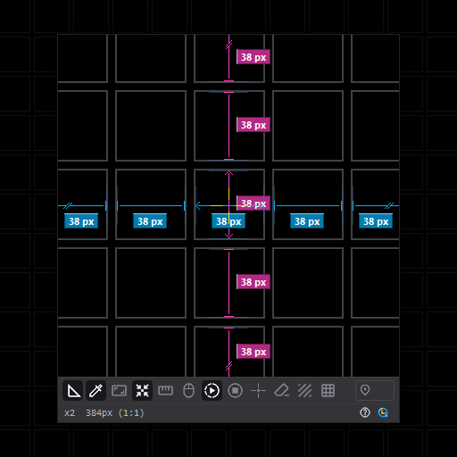

# MagicLoupe v1.0.0

[한국어 안내](README-ko.md)

https://magicloupe.vercel.app/

A productivity tool that inspects and measures everything on your Windows
screen, precisely. One loupe window magnifies the live screen, measures the
gaps and sizes of elements automatically, and picks the exact color of a pixel.

## Download

Grab the latest build from the [Releases page](https://github.com/legendsteel11/MagicLoupe-App/releases/latest).

- **`MagicLoupe.exe`**: one file, nothing to install. Keep it wherever you like
  and run it.

Runs on Windows 11 or later, with no administrator rights needed. Settings live
in `%AppData%\MagicLoupe`.

## Screenshots

## Features

- **Live magnification.** Magnifies the screen live, up to 24x, with no
  smoothing.
- **Real-time automatic gap measurement.** Finds the gaps between elements in
  the lens and labels them in pixels.
- **Real-time automatic size measurement.** Measures the width and height of the
  element under the crosshair.
- **Color picker.** Click the lens to pick a color, then copy it as RGB, a
  # code or the bare code. It always reads the original color, whatever filter
  is on.
- **Measure and exclude areas.** Shift-drag to set the measuring area, Alt-drag
  to leave an area out.
- **Custom masks.** Draw masks in any shape, then measure the gaps and sizes
  between them and the space around them.
- **Overlay filters.** Apply a green, red, mono, dark or light filter to read
  measurements easily on a busy screen.
- **Screen freeze.** Freeze a screen that keeps changing and measure it at rest.
- **Gap sum.** Click gaps one by one to add them together.
  Ctrl+Alt+F switches it on and off.
- **Ruler guides and grid.** Pull guides out of the rulers and line them up with
  elements, show the grid and snap to it.
- **Capture.** Save the lens with its marks as an image with Ctrl+Alt+C.

The full list of features is on the [website](https://magicloupe.vercel.app/#details).

## First run

MagicLoupe starts in the system tray. Click the tray icon or press the summon
shortcut to bring up the loupe; the tray menu shows the shortcut.

Windows may show a SmartScreen prompt the first time. Choose **More info**, then
**Run anyway**.

## About this repository

This is the public home of MagicLoupe: the website (deployed on Vercel) and the
release binaries. The application source is kept private.

Icons: [Material Symbols](https://fonts.google.com/icons) by Google
(Apache License 2.0).

## License

Free for anyone to use. Provided as is, without warranty of any kind, and used
at your own risk. Full text: [LICENSE.md](LICENSE.md)
